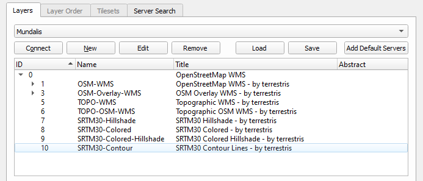

 

WMS, short for [*web map service*](https://en.wikipedia.org/wiki/Web_Map_Service), is a popular way of publishing maps by professional GIS software (and seldomly used by non-GISers). This format is similar to map tiles, but more generic and not so well optimized for use in web maps. A WMS image is defined by the coordinates of its corners - a calculation that Leaflet does under the hood.

TMS stands for [*tiled map service*](https://en.wikipedia.org/wiki/Tile_Map_Service), and is a map tiling standard more focused on web maps, very similar to the map tiles that Leaflet expects in a `L.TileLayer`.

WMTS, for [*web map tile service*](https://en.wikipedia.org/wiki/Web_Map_Tile_Service), is the standard protocol for map tiles and serves map tiles directly usable in a `L.TileLayer`.

## WMS in Leaflet

When somebody publishes a WMS service, most likely they link to something called a `GetCapabilities` document. For this tutorial, we'll use the WMS offered by [*Mundialis*](https://www.mundialis.de) at http://ows.mundialis.de/services/service? . The service capabilities are described at the following URL:

	http://ows.mundialis.de/services/service?request=GetCapabilities

Leaflet does not understand WMS `GetCapabilities` documents. Instead, you have to create a `L.TileLayer.WMS` layer, provide the base WMS URL, and specify whatever WMS options you need.

The base WMS URL is simply the `GetCapabilities` URL, without any parameters, like so:

	http://ows.mundialis.de/services/service?

And the way to use that in a Leaflet map is simply:

	var map = L.map(mapDiv, mapOptions);

	var wmsLayer = L.tileLayer.wms('http://ows.mundialis.de/services/service?', wmsOptions).addTo(map);

An instance of `L.TileLayer.WMS` needs at least one option: `layers`. Be careful, as the concept of "layer" in Leaflet is different from the concept of "layer" in WMS!

WMS servers define a set of *layers* in the service. These are defined in the `GetCapabilities` XML document, which most times is tedious and difficult to understand. Usually it's a good idea to use software such as [QGIS to see what layers are available in a WMS server](http://www.qgistutorials.com/en/docs/working_with_wms.html) to see the layer names available:

We can see that the *Mundialis* WMS has a WMS layer named `TOPO-OSM-WMS` with a basemap. Let's see how it looks:

	var wmsLayer = L.tileLayer.wms('http://ows.mundialis.de/services/service?', {
		layers: 'TOPO-OSM-WMS'
	}).addTo(map);



Or we can try the `SRTM30-Colored-Hillshade` WMS layer:

	var wmsLayer = L.tileLayer.wms('http://ows.mundialis.de/services/service?', {
		layers: 'SRTM30-Colored-Hillshade'
	}).addTo(map);



The `layers` option is a comma-separated list of layers. If a WMS service has defined several layers, then a request for a map image can refer to more than one layer.

For the example WMS server we're using, there is a `TOPO-WMS` WMS layer showing the world topography, and a `OSM-Overlay-WMS` WMS layer showing the names of places. The WMS server will compose both layers in one image if we request both, separated with a comma:

	var topographyAndPlaces = L.tileLayer.wms('http://ows.mundialis.de/services/service?', {
		layers: 'TOPO-WMS,OSM-Overlay-WMS'
	}).addTo(map);

Note this will request *one* image to the WMS server. This is different than creating a `L.TileLayer.WMS` for the topography, another one for the places, and adding them both to the map. In the first case, there is one image request and it's the WMS server who decides how to compose (put on top of each other) the image. In the second case, there would be two image requests and it's the Leaflet code running in the web browser who decides how to compose them.

If we combine this with the [layers control](/examples/layers-control.html), then we can build a simple map to see the difference:

	var basemaps = {
		Topography: L.tileLayer.wms('http://ows.mundialis.de/services/service?', {
			layers: 'TOPO-WMS'
		}),

		Places: L.tileLayer.wms('http://ows.mundialis.de/services/service?', {
			layers: 'OSM-Overlay-WMS'
		}),

		'Topography, then places': L.tileLayer.wms('http://ows.mundialis.de/services/service?', {
			layers: 'TOPO-WMS,OSM-Overlay-WMS'
		}),

		'Places, then topography': L.tileLayer.wms('http://ows.mundialis.de/services/service?', {
			layers: 'OSM-Overlay-WMS,TOPO-WMS'
		})
	};

	L.control.layers(basemaps).addTo(map);

	basemaps.Topography.addTo(map);

Change to the "Topography, then places" option, so you can see the places "on top" of the topography, but the WMS server is clever enough to display building labels on top of that. It's up to the WMS server how to compose layers when asked for many.



### Notes to GIS users of WMS services

From a GIS point of view, WMS handling in Leaflet is quite basic. There's no `GetCapabilities` support, no legend support, and no `GetFeatureInfo` support.

`L.TileLayer.WMS` has extra options, which can be found in [Leaflet's API documentation](/reference.html#tilelayer-wms). Any option not described there will be passed to the WMS server in the `getImage` URLs.

Also note that Leaflet supports very few [coordinate systems](https://en.wikipedia.org/wiki/Spatial_reference_system): `CRS:3857`, `CRS:3395` and `CRS:4326` (See the documentation for `L.CRS`). If your WMS service doesn't serve images in those coordinate systems, you might need to use [Proj4Leaflet](https://github.com/kartena/Proj4Leaflet) to use a different coordinate system in Leaflet. Other than that, just use the right CRS when initializing your map, and any WMS layers added will use it:

	var map = L.map('map', {
		crs: L.CRS.EPSG4326
	});

	var wmsLayer = L.tileLayer.wms('http://ows.mundialis.de/services/service?', {
		layers: 'TOPO-OSM-WMS'
	}).addTo(map);


	
	
## TMS in Leaflet

Leaflet doesn't have explicit support for TMS services, but the tile naming structure is so similar to the common `L.TileLayer` naming scheme, that displaying a TMS service is almost trivial.

Let's consider a TMS server with the following endpoint:

	http://base_url/tms/1.0.0

Checking the [MapCache help about TMS](http://mapserver.org/mapcache/services.html) and the [TMS specification](https://wiki.osgeo.org/wiki/Tile_Map_Service_Specification) you can see that the URL for a map tile in TMS looks like:

	http://base_url/tms/1.0.0/ {tileset} / {z} / {x} / {y} .png

To use the TMS services as a `L.TileLayer`, we can check the capabilities document (the same as the base endpoint, in our case [`http://base_url/tms/1.0.0`](http://base_url/tms/1.0.0)) to see what `tileset`s are available, and build our base URLs:

	http://base_url/tms/1.0.0/{example_layer}@png/{z}/{x}/{y}.png

And use the `tms:true` option when instantiating the layers, like so:

	var tms_example = L.tileLayer('http://base_url/tms/1.0.0/example_layer@png/{z}/{x}/{y}.png', {
		tms: true
	}).addTo(map);

A new feature in **Leaflet 1.0** is the ability to use `{-y}` in the URL instead of a `tms: true` option, e.g.:

	var layer = L.tileLayer('http://base_url/tms/1.0.0/tileset/{z}/{x}/{-y}.png');

The `tms: true` option (in Leaflet 0.7) or `{-y}` (in Leaflet 1.0) are needed because the origin of coordinates of vanilla `L.TileLayer`s is the top left corner, so the Y coordinate goes *down*. In TMS, the origin of coordinates is the *bottom* left corner so the Y coordinate goes *up*.

Besides the difference in the `y` coordinate and the discovery of tilesets, TMS services serve tiles exactly in the way that `L.TileLayer` expects.
