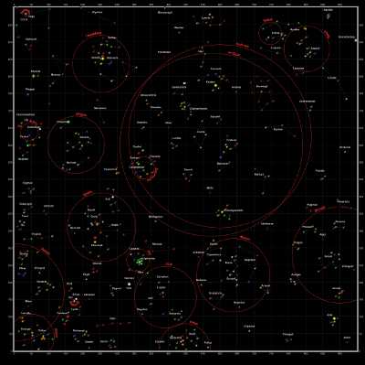

## Not of this earth

Sometimes, maps do not represent things on the surface of the earth and, as such, do not have a concept of geographical latitude and geographical longitude. Most times this refers to big scanned images, such as game maps.

For this tutorial we've picked a starmap from Star Control II, a game that is now available as the [open-source project The Ur-Quan Masters](https://en.wikipedia.org/wiki/Star_Control_II#The_Ur-Quan_Masters). These maps were made with a [tool to read the open-source data files](http://www.highprogrammer.com/alan/games/video/uqm/index.html) of the game, and look like this:

 

The game has a built-in square coordinate system, as can be seen in the corners. This will allow us to establish a coordinate system.

 

## CRS.Simple

**CRS** stands for [coordinate reference system](https://en.wikipedia.org/wiki/Spatial_reference_system), a term used by geographers to explain what the coordinates mean in a coordinate vector. For example, `[15, 60]` represents a point in the Indian Ocean if using latitude-longitude on the earth, or the solar system Krueger-Z in our starmap.

A Leaflet map has one CRS (and *one* CRS *only*), that can be changed when creating the map. For our game map we'll use `CRS.Simple`, which represents a square grid:

	var map = L.map('map', {
		crs: L.CRS.Simple
	});

Then we can just add a `L.ImageOverlay` with the starmap image and its *approximate* bounds:

	var bounds = [[0,0], [1000,1000]];
	var image = L.imageOverlay('uqm_map_full.png', bounds).addTo(map);

And show the whole map:

	map.fitBounds(bounds);



This example doesn't quite work, as we cannot see the whole map after doing a `fitBounds()`.

## Common gotchas in CRS.Simple maps

In the default Leaflet CRS, `CRS.Earth`, 360 degrees of longitude are mapped to 256 horizontal pixels (at zoom level 0) and approximately 170 degrees of latitude are mapped to 256 vertical pixels (at zoom level 0).

In a `CRS.Simple`, one horizontal map unit is mapped to one horizontal pixel, and *idem* with vertical. This means that the whole map is about 1000x1000 pixels big and won't fit in our HTML container. Luckily, we can set `minZoom` to values lower than zero:

	var map = L.map('map', {
		crs: L.CRS.Simple,
		minZoom: -5
	});

### Pixels vs. map units

One common mistake when using `CRS.Simple` is assuming that the map units equal image pixels. In this case, the map covers 1000x1000 units, but the image is 2315x2315 pixels big. Different cases will call for one pixel = one map unit, or 64 pixels = one map unit, or anything. **Think in map units** in a grid, and then add your layers (`L.ImageOverlay`s, `L.Marker`s and so on) accordingly.

In fact, the image we're using covers more than 1000 map units - there is a sizable margin. Measuring how many pixels there are between the 0 and 1000 coordinates, and extrapolating, we can have the right coordinate bounds for this image:

	var bounds = [[-26.5,-25], [1021.5,1023]];
	var image = L.imageOverlay('uqm_map_full.png', bounds).addTo(map);

While we're at it, let's add some markers:

	var sol = L.latLng([ 145, 175.2 ]);
	L.marker(sol).addTo(map);
	map.setView( [70, 120], 1);



### This is not the `LatLng` you're looking for

You'll notice that Sol is at coordinates `[145,175]` instead of `[175,145]`, and the same happens with the map center. Coordinates in `CRS.Simple` take the form of `[y, x]` instead of `[x, y]`, in the same way Leaflet uses `[lat, lng]` instead of `[lng, lat]`.

<small>(In technical terms, Leaflet prefers to use [`[northing, easting]`](https://en.wikipedia.org/wiki/Easting_and_northing) over `[easting, northing]` - the first coordinate in a coordinate pair points "north" and the second points "east")</small>

The debate about whether `[lng, lat]` or `[lat, lng]` or `[y, x]` or `[x, y]` [is not new, and there is no clear consensus](http://www.macwright.org/lonlat/). This lack of consensus is why Leaflet has a class named `L.LatLng` instead of the more confusion-prone `L.Coordinate`.

If working with `[y, x]` coordinates with something named `L.LatLng` doesn't make much sense to you, you can easily create wrappers for them:

	var yx = L.latLng;

	var xy = function(x, y) {
		if (L.Util.isArray(x)) {    // When doing xy([x, y]);
			return yx(x[1], x[0]);
		}
		return yx(y, x);  // When doing xy(x, y);
	};

Now we can add a few stars and even a navigation line with `[x, y]` coordinates:

	var sol      = xy(175.2, 145.0);
	var mizar    = xy( 41.6, 130.1);
	var kruegerZ = xy( 13.4,  56.5);
	var deneb    = xy(218.7,   8.3);

	L.marker(     sol).addTo(map).bindPopup(      'Sol');
	L.marker(   mizar).addTo(map).bindPopup(    'Mizar');
	L.marker(kruegerZ).addTo(map).bindPopup('Krueger-Z');
	L.marker(   deneb).addTo(map).bindPopup(    'Deneb');

	var travel = L.polyline([sol, deneb]).addTo(map);

The map looks pretty much the same, but the code is a bit more readable:


