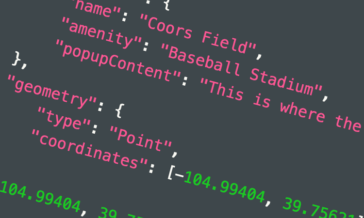
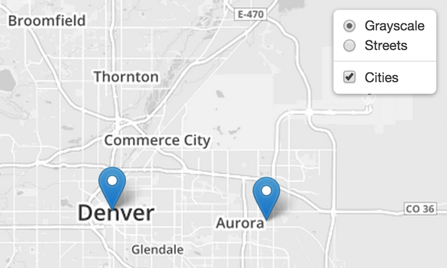

### Leaflet Tutorials

Every example here comes with step-by-step code explanation and is easy enough even for beginner JavaScript developers.

***
[][1]

### [Leaflet Quick Start Guide][1]

A simple step-by-step guide that will quickly get you started with Leaflet basics, including setting up a Leaflet map (with CloudMade tiles) on your page, working with markers, polylines and popups, and dealing with events.

***
[][2]

### [Leaflet on Mobile][2]

In this example, you'll learn how to create a fullscreen map tuned for mobile devices like iPhone, iPad or Android phones, and how to easily detect and use the current user location.

***
[][3]

### [Markers With Custom Icons][3]

In this pretty example, you'll learn how to easily define your own icons for use by the markers you put on the map.

***
[][4]

### [Using GeoJSON with Leaflet][4]

In this example, you'll learn how to create and interact with map vectors created from [GeoJSON][5] objects.

***
[][6]

### [Layer Groups and Layers Control][6]

A tutorial on how to manage groups of layers and use the layer switching control.

<!--***
<h3><a class="noimpl" href="#">Custom Controls</a></h3>

A brief tutorial on implementing custom map controls.

***
<h3><a class="noimpl" href="#">Custom Overlays</a></h3>

If markers, popups and vectors are not enough for you, here's a guide for creating your own map overlays (things to put on a map).
-->

***
If you find that an important tutorial is missing here, let us know!

 [1]: examples/quick-start.html
 [2]: examples/mobile.html
 [3]: examples/custom-icons.html
 [4]: examples/geojson.html
 [5]: http://geojson.org/
 [6]: examples/layers-control.html
