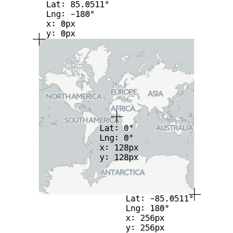
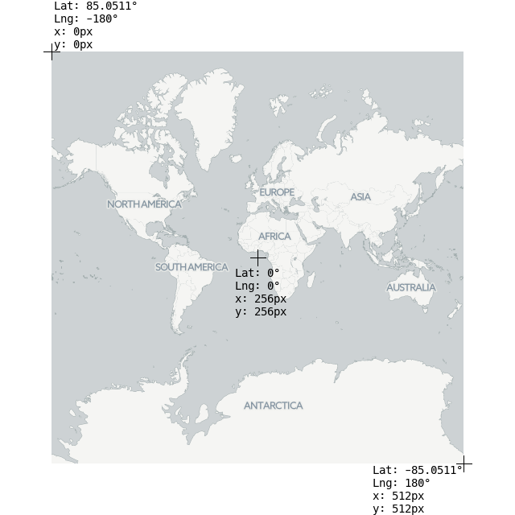
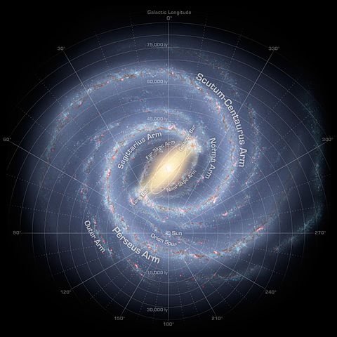

## Custom CRSs

### `L.LatLng` vs pixels

Internally, Leaflet converts map layers with `LatLng`s into HTML elements with pixel coordinates, so it needs a way of knowing which `LatLng` corresponds to which pixel and vice versa.

In web browsers, pixel use a [cartesian system with its origin in the top-left](https://developer.mozilla.org/en-US/docs/Web/CSS/transform-function). This is why, in Leaflet, pixel coordinates are `L.Point`s with the form `(x, y)`, where `x` is the distance *right* and `y` is the distance *down*.

For example, in a default map at zoom level 0:

* the `LatLng` `(85.051128, -180)` has the pixel coordinate `(0, 0)`
* the `LatLng` `(-85.051128, 180)` has the pixel coordinate `(256, 256)`
* the `LatLng` `(0, 0)` has the pixel coordinate `(128, 128)`

 

The CRS of the map is responsible for converting between `LatLng`s and pixel coordinates for any given zoom level. A CRS has two main functions to perform this: `latLngToPoint` and `pointToLatLng`. In the default CRS (`L.CRS.EPSG3857`) they work like this:

	L.CRS.EPSG3857.latLngToPoint( L.latlng(0, 0), 0);	// Returns a L.Point with x=128, y=128
	L.CRS.EPSG3857.latLngToPoint( L.latlng(85.0511, -180), 0);	// Returns a L.Point with x=0, y=0

	L.CRS.EPSG3857.pointToLatLng( L.point(128, 128), 0);	// Returns a L.LatLng with lat=0, lng=0
	L.CRS.EPSG3857.pointToLatLng( L.point(256, 256), 0);	// Returns a L.LatLng with lat=-85.0511, lng=180

The CRS also informs Leaflet of how large the map is (once again, for any given zoom level). The result is a `L.Bounds` containing a bounding box measuring pixels, or `null` if there is no bounding box (i.e. there is an infinite plane). For the default CRS, zoom level 0:

	L.CRS.EPSG3857.getProjectedBounds(0);	// Returns a `L.Bounds` with min=(0, 0) and max=(256, 256)

When you zoom in to zoom level 1, (by default) everything doubles in size.

 

	L.CRS.EPSG3857.latLngToPoint( L.latlng(0, 0), 0);	// Returns a L.Point with x=256, y=256
	L.CRS.EPSG3857.getProjectedBounds(1);	// Returns a `L.Bounds` with min=(0, 0) and max=(512, 512)

The CRS must also tell Leaflet how much things scale when changing through zoom levels. This is done with the `scale` and `zoom` functions:

	L.CRS.EPSG3857.scale(0);	// How many arbitrary units are there in zoom level 0
	L.CRS.EPSG3857.scale(1);	// How many arbitrary units are there in zoom level 1
	// Note that L.CRS.EPSG3857.scale(1) is the double of * L.CRS.EPSG3857.scale(0)

When you use `LatLng`s in Leaflet, they magically get converted to pixel coordinates so things appear on the right location in your screen. Internally, Leaflet needs to set the position of map elements in pixels from the top-left of the map container

In Leaflet, the main mission of a CRS is to translate from map coordinates to screen pixel coordinates with two operations:

* `latLngToPoint`: Given a `L.LatLng` and a zoom level, return a `L.Point` with a pixel coordinate
* `pointToLatLng`: Given a `L.Point` with a pixel coordinate and a zoom level, return a `L.LatLng`

## Polar coordinates

Leaflet does not only support latitude-longitude geographical coordinates or a [simple grid](../crs-simple/crs-simple.html), it can support any user-defined coordinate system.

For this tutorial, we'll implement a [polar coordinate system](https://en.wikipedia.org/wiki/Polar_coordinate_system) on an arctistic rendering of the Milky Way]():

 

We'll follow the conventions on polar coordinate systems: the coordinates are ρ (greek letter [rho](https://en.wikipedia.org/wiki/Rho)) and φ (greek letter [phi](https://en.wikipedia.org/wiki/Phi)). For any point, ρ is the distance to the origin of coordinates, and φ the angle from the polar axis. In this tutorial we'll make φ equal to the galactic longitude (counter-clockwise, with φ=0 pointing upwards). While φ is measured in degrees, ρ will be measured in light-years.

As seen in the [`CRS.Simple`](../crs-simple/crs-simple.html) tutorial, `LatLng` doesn't always make sense. We can easily create aliases for `RhoPhi`:

	var RhoPhi = L.LatLng;	// Class constructor
	var rhoPhi = L.latLng;	// Factory method

If you're a math nerd, note that the following code is also valid Javascript:

	var ΡΦ = L.LatLng;
	var ρΦ = L.latLng;

We can create a minimal CRS with some defaults inherited from the abstract class `L.CRS` by using `L.extend`:

	L.CRS.Galactic = L.extend({}, L.CRS, {
		latLngToPoint: function (latlng, zoom) {
			return L.point(...);
		},

		pointToLatLng: function (point, zoom) {
			return L.latLng(...);
		}
	}

## CRS.Simple

**CRS** stands for [coordinate reference system](https://en.wikipedia.org/wiki/Spatial_reference_system), a term used by geographers to explain what the coordinates mean in a coordinate vector. For example, `[15, 60]` represents a point in the Indian Ocean if using latitude-longitude on the earth, or the solar system Krueger-Z in our starmap.

A Leaflet map has one CRS (and *one* CRS *only*), that can be changed when creating the map. For our game map we'll use `CRS.Simple`, which represents a square grid:

	var map = L.map('map', {
		crs: L.CRS.Simple
	});

Then we can just add a `L.ImageOverlay` with the starmap image and its *approximate* bounds:

	var bounds = [[0,0], [1000,1000]];
	var image = L.imageOverlay('uqm_map_full.png', bounds).addTo(map);

And show the whole map:

	map.fitBounds(bounds);

<iframe src='crs-simple-example1.html' width='616' height='416'></iframe>

You can see [this example](crs-simple-example1.html) stand-alone. It doesn't quite work, as we cannot see the whole map after doing a `fitBounds()`.

## Common gotchas in CRS.Simple maps

In the default Leaflet CRS, `CRS.Earth`, 360 degrees of longitude are mapped to 256 horizontal pixels (at zoom level 0) and approximately 170 degrees of latitude are mapped to 256 vertical pixels (at zoom level 0).

In a `CRS.Simple`, one horizontal map unit is mapped to one horizontal pixel, and *idem* with vertical. This means that the whole map is about 1000x1000 pixels big and won't fit in our HTML container. Luckily, we can set `minZoom` to values lower than zero:

	var map = L.map('map', {
		crs: L.CRS.Simple,
		minZoom: -5
	});

### Pixels vs. map units

One common mistake when using `CRS.Simple` is assuming that the map units equal image pixels. In this case, the map covers 1000x1000 units, but the image is 2315x2315 pixels big. Different cases will call for one pixel = one map unit, or 64 pixels = one map unit, or anything. **Think in map units** in a grid, and then add your layers (`L.ImageOverlay`s, `L.Marker`s and so on) accordingly.

In fact, the image we're using covers more than 1000 map units - there is a sizable margin. Measuring how many pixels there are between the 0 and 1000 coordinates, and extrapolating, we can have the right coordinate bounds for this image:

	var bounds = [[-26.5,-25], [1021.5,1023]];
	var image = L.imageOverlay('uqm_map_full.png', bounds).addTo(map);

While we're at it, let's add some markers:

	var sol = L.latLng([ 145, 175.2 ]);
	L.marker(sol).addTo(map);
	map.setView( [70, 120], 1);

<iframe src='crs-simple-example2.html' width='616' height='416'></iframe>

You can see [this example](crs-simple-example2.html) stand-alone.

### This is not the `LatLng` you're looking for

You'll notice that Sol is at coordinates `[145,175]` instead of `[175,145]`, and the same happens with the map center. Coordinates in `CRS.Simple` take the form of `[y, x]` instead of `[x, y]`, in the same way Leaflet uses `[lat, lng]` instead of `[lng, lat]`.

<small>(In technical terms, Leaflet prefers to use [`[northing, easting]`](https://en.wikipedia.org/wiki/Easting_and_northing) over `[easting, northing]` - the first coordinate in a coordinate pair points "north" and the second points "east")</small>

The debate about whether `[lng, lat]` or `[lat, lng]` or `[y, x]` or `[x, y]` [is not new, and there is no clear consensus](http://www.macwright.org/lonlat/). This lack of consensus is why Leaflet has a class named `L.LatLng` instead of the more confusion-prone `L.Coordinate`.

If working with `[y, x]` coordinates with something named `L.LatLng` doesn't make much sense to you, you can easily create wrappers for them:

	var yx = L.latLng;

	var xy = function(x, y) {
		if (L.Util.isArray(x)) {    // When doing xy([x, y]);
			return yx(x[1], x[0]);
		}
		return yx(y, x);  // When doing xy(x, y);
	};

Now we can add a few stars and even a navigation line with `[x, y]` coordinates:

	var sol      = xy(175.2, 145.0);
	var mizar    = xy( 41.6, 130.1);
	var kruegerZ = xy( 13.4,  56.5);
	var deneb    = xy(218.7,   8.3);

	L.marker(     sol).addTo(map).bindPopup(      'Sol');
	L.marker(   mizar).addTo(map).bindPopup(    'Mizar');
	L.marker(kruegerZ).addTo(map).bindPopup('Krueger-Z');
	L.marker(   deneb).addTo(map).bindPopup(    'Deneb');

	var travel = L.polyline([sol, deneb]).addTo(map);

The [resulting map](crs-simple-example3.html) looks pretty much the same, but the code is a bit more readable.

<iframe src='crs-simple-example3.html' width='616' height='416'></iframe>

